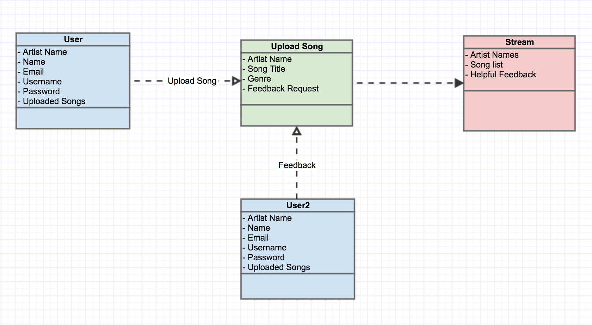

# OurAudio

## Table of Contents
- [5.1 Introduction](#51-introduction)
- [5.2 Functional Requirements](#52-functional-requirements)
- [5.3 Performance Requirements](#53-performance-requirements)
- [5.4 Environmental Requirements](#54-environmental-requirements)

## 5.1 Introduction

OurAudio web application is a music platform for musicians to share, promote and get feedback on their song. This platform is intended for those who are either new to the music industry or need help to get their sound promoted. OurAudio would not only help out the musicians but however it will help the public/listeners to find their new favorite artist. This web application would be available to users who sign up and create an account with OurAudio. Each user will have a profile page which holds all of their submitted songs and songs awaiting for feedback. Also, the profile page would have a feed of all the promoted tracks that the musician has requested OurAudio to promote. Users will only be able to receive feedback on their songs if and only if they gave feedback on a different users song. The following UML diagram shows a structure of how the application works.

The remainder of this document is structured as follows.  Section 5.2 contains the Functional Requirements of the application.  This will cover primarily everything that the user interacts with.  Section 5.3 contains the Performance Requirements.  This section addresses the applications performance, outlining any requirements in speed and efficiency when it is being used.  Finally, Section 5.4 contains the Environmental Requirements.  This outlines the software and hardware required for building, testing, and running the application.
