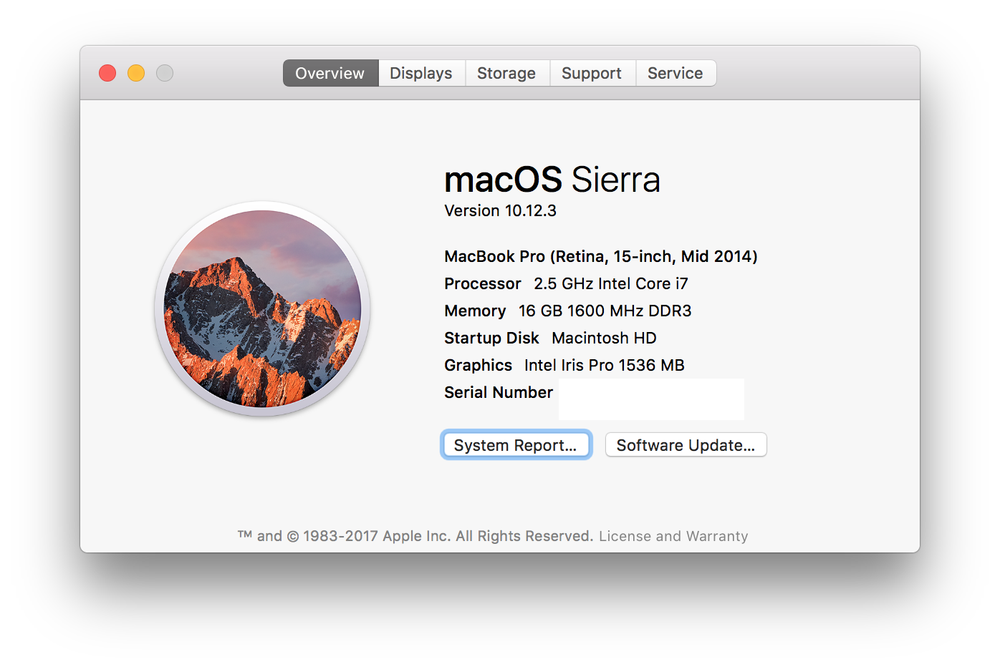
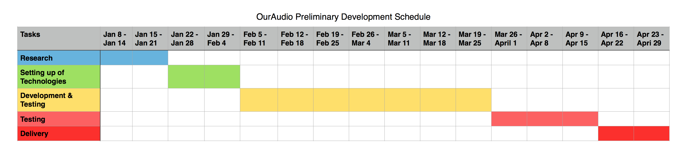

# OurAudio

## Table of Contents
- [4.1 Plan Introduction](#41-plan-introduction)
  - [4.1.1 Project Deliverables](#411-project-deliverables)
- [4.2 Project Resources](#42-project-resources)
  - [4.2.1 Hardware Resources](#421-hardware-resources)
  - [4.2.2 Software Resources](#422-software-resources)
- [4.3 Project Organization](#43-project-organization)
- [4.4 Project Schedule](#44-project-schedule)
  - [4.4.1 PERT/GANTT Chart](#441-pert-gantt-chart)
  - [4.4.2 Task/Resource Table](#442-task-resource-table)

## 4.1 Plan Introduction
This Software Development Plan (SDP) provides the details of the planned development for OurAudio, which provides an application to both beginner and intermediate musicians to share and request feedback on their newly produced song.  

OurAudio web application will provide an environment for musicians to collaborate and give one another considerable feedback. In order for musicians to request feedback he/she would need to upload a song via dashboard/profile page. The musician will then submit the song under a specific genre category and give some detail about their song that they have produced. Once the song is submitted, the song will be evaluated and given feedback by another musician. Subsequently, the songs with the most useful feedback will then be logged onto the stream page. The stream page will provide all of the best songs with the best feedbacks for insight.

The development of this application starts on January 9 2017, will involve a thorough research about which technologies best fit the requirements of this application. The project development is broken down into milestones; starting from the first one the project proposal, which is set to be completed in week 2 of the development. Following that Software Requirement Specification set to be complete with room for future enhancements in week 5. Week 8 will have Software Development Plan or Software/Database Design Description Document. Week 11 will have the final versions of the week 8 deliverables resubmitted, and in week 13 the Software Requirements Specification will occur. In weeks 14-16 the Preliminary Demonstration Presentation will take place. Finally, week 17 with have the final product ready for demonstration and delivery.

## 4.1.1 Project Deliverables

### 4.1.1 Project Proposal
The project proposal involves comping up with 3 different project ideas to be proposed to the class and the instructor with each one described in one paragraph.

_Due Date: January 16 2017_

### 4.1.1.2 Software Requirements Specifications
The Software Requirements Specifications is intended to be a part of the contract between customer and the development company, and in this case the instructor. The document specifies exactly all the functionalities to be implemented in the software.

_Due Date: February 2 2017_

### 4.1.1.3 Software Development Plan
The Software Development Plan is intended to describe the process that will be used during the semester to develop the app, and this includes the production of all required documents and software for this project.

_Due Date: February 27 2017_

### 4.1.1.4 Software/Database Design Description Document
This document will not be provided

### 4.1.1.5 Preliminary Demonstration Presentations
The preliminary Demonstration presentation of OurAudio is the initial presentation for the project to demonstrate to classmates/instructors the final stages of the app.

### 4.1.1.6 Final Presentations/ Demonstrations
The final product will involve delivering the final project. The app delivery will involve the submission of all code and all supporting documents.

## 4.2 Project Resources
OurAudio web application has hardware resources, software resources and a project manager. The software will be developed entirely by Irakli Khizanishvili. Irakli will be responsible for pitching the idea to the instructor and classmates, writing all supporting documents and developing all the code required for this application, and finally presenting and delivering the final product.

### 4.2.1 Hardware Resources
For the development and testing of this application a Retina MacBook Pro (15 inch, Mid 2014) will be used.

### 4.2.2 Software Resources

  - Operating System: macOS Sierra
  - Text Editor: Atom
  - Browser: Google Chrome
  - Related Packages: JS, Nodejs, Expressjs, npm, MongoDB

## 4.3 Project Organization
The software will be developed by Irakli Khizanishvili. Irakli will be responsible for pitching the idea to the instructor, writing all the supporting documents, and developing all the code required for this application.

  - Idea - one out of the three proposed projects will be chosen.
  - Requirement Gathering - involves researching, studying and determining the requirements for OurAudio.
  - Documentation - writing all the needed documents for OurAudio.
  - Development - involved developing the actual application
  - Testing - testing will happen dynamically while developing.
  - Presenting - presentation and poster board will be made for the public.
  - Delivering - code delivery at the end of the project timeline.

## 4.4 Project Schedule
Project Schedule provides information for OurAudio project.

### 4.4.1 PERT/GANTT Chart

### 4.4.2 Task/Resource Table

| Task     | Hardware     | Software |
| :------- | :----------- | :------- |
| Look & Feel | MacBook  | Node.js, Chrome, MongoDB, macOS, GitHub |
| Login | MacBook  | Node.js, Bcrypt, Passport, Expressjs, GitHub |
| Logout | MacBook  | Node.js, Bcrypt, Passport, Expressjs, GitHub |
| Register | MacBook  | Node.js, Bcrypt, Passport, Expressjs, GitHub |
| Profile Page | MacBook  | Node.js, Chrome, MongoDB, macOS, GitHub |
| Stream Page | MacBook  | Node.js, Chrome, MongoDB, macOS, GitHub |
| SoundCloud API | MacBook  | Node.js, Chrome, MongoDB, macOS, GitHub |
